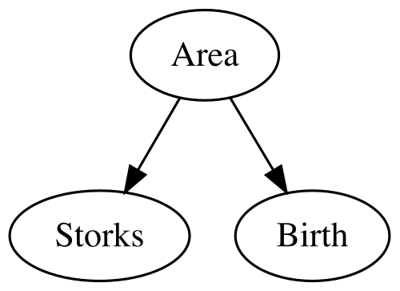

```{r setup, include = FALSE}
knitr::opts_chunk$set(
    collapse = TRUE,
    comment = "#>",
    eval = FALSE
)
```

d-separation (Shipley, 2000, 2003) is the foundation of causal inference in `because`. It tests whether your hypothesized causal model correctly represents the conditional independencies in your data.

### The Problem with Correlations

In the simple linear regression presented as an example in the previous vignette, we modeled the relationship between two variables, X and Y. However, regression only tells us about correlations, not causation. We can only say that X is related to Y or also that X predicts Y, but we cannot say that X causes Y. There are indeed three reasons why X and Y could correlate (if this was real data of course, and not data we simulated with a predefined correlation!):

1.  **X → Y**: X causes Y
2.  **Y → X**: Y causes X
3.  **X ← Z → Y**: There is a common cause Z causing both.

The problem is that correlation alone cannot distinguish between these three scenarios.

Let's look at a classic example A correlative study trying to establish if storks deliver babies (Matthews, 2000). we investigated this example previously in Gonzalez-Voyer & von Hardenberg (2014), and the data and a tutorial analysing this example with traditional path analysis is available as supplementary materials to that book chapter and here: <https://github.com/achazhardenberg/mpcm-OPM>.

Let's load the storks.dat dataframe available in the package and take a look at the relationship between the number of stork pairs and the number of babies born in different European countries (in thousands per year):

```{r}
# load data
data(storks.dat)
plot(storks.dat$Storks, storks.dat$Birth,
    xlab = "Number of Stork Pairs",
    ylab = "Number of Babies Born (thousands)"
)
```

```{r, echo=FALSE, eval=TRUE, out.width="100%"}
knitr::include_graphics("figures/storks_vs_babies.png")
```

We can see that there appears to be a positive correlation between the number of stork pairs and the number of babies born and we can confirm this with a simple linear regression:

```{r}
lm_storks <- lm(Birth ~ Storks, data = storks.dat)
summary(lm_storks)
```

``` txt
Call:
lm(formula = Birth ~ Storks, data = storks.dat)

Residuals:
   Min     1Q Median     3Q    Max 
-478.8 -166.3 -144.9   -2.0  631.1 

Coefficients:
             Estimate Std. Error t value Pr(>|t|)   
(Intercept) 2.250e+02  9.356e+01   2.405   0.0295 * 
Storks      2.879e-02  9.402e-03   3.063   0.0079 **
---
Signif. codes:  
0 ‘***’ 0.001 ‘**’ 0.01 ‘*’ 0.05 ‘.’ 0.1 ‘ ’ 1

Residual standard error: 332.2 on 15 degrees of freedom
Multiple R-squared:  0.3847,    Adjusted R-squared:  0.3437 
F-statistic:  9.38 on 1 and 15 DF,  p-value: 0.007898
```

The positive relationship between stork pairs and births is confirmed (p = 0.008, as already reported by Matthews, 2000), but does this mean that storks deliver babies? Or could it be that both are influenced by a third variable, such as Country Area? Let's check if Area correlates with Births and Storks:

```{r}
birth_area.lm <- lm(Birth ~ Area, data = storks.dat)
summary(birth_area.lm)
# Coefficients:
#              Estimate Std. Error t value Pr(>|t|)
# (Intercept) -7.7754992 56.9376784  -0.137    0.893
# Area         0.0017229  0.0001861   9.259 1.36e-07 ***

storks_area.lm <- lm(Storks ~ Area, data = storks.dat)
summary(storks_area.lm)
# Coefficients:
#              Estimate Std. Error t value Pr(>|t|)
# (Intercept) -6.069e+01  2.591e+03  -0.023   0.9816
# Area         2.331e-02  8.467e-03   2.753   0.0148 *
```

Indeed, both Births and Storks correlate significantly with Area (p \<
0.0001 and p = 0.015 respectively). Matthews (2000) argued that the
observed correlation between Storks and Births is actually due to the confounding effect of Area: larger countries have more storks and more births, leading to a spurious correlation between Storks and Births. Indeed, when controlling statistically for Area in a multiple regression, the effect of Storks on Births becomes non-significant:

```{r}
lm_birth_storks_area <- lm(Birth ~ Storks + Area,
    data = storks.dat
)
summary(lm_birth_storks_area)

# Coefficients:
#               Estimate Std. Error t value Pr(>|t|)
# (Intercept) -7.4116870 56.7021798  -0.131    0.898
# Storks       0.0059949  0.0056510   1.061    0.307
# Area         0.0015832  0.0002273   6.964 6.62e-06 ***
```

In a causal inference framework, we can represent these three variables and their causal relationships using a Directed Acyclic Graph (DAG):

```{r}
library(DiagrammeR)
dag_storks <- "digraph {
  Area -> Storks
  Area -> Birth
}"
DiagrammeR::grViz(dag_storks)
```

```{r, echo=FALSE, eval=TRUE, out.width="100%"}

```

Directed Acyclic Graphs (DAGs) explicitly state your causal assumptions, and with the multiple regression above we have effectively tested the conditional independence implied by this DAG: Storks *\|\|* Birth \| {Area} (Storks and Births are independent conditional on Area) which translates statistically in the d-separation test we just performed by including Area as a covariate in the regression of Births on Storks. Our causal model is therefore consistent with the data. "Consistent" here means that the conditional independencies implied by the DAG hold in the
data, but it does not prove that this causal model is actually correct. Other models may also be consistent with the data and with only three variables it is impossible to distinguish between different causal models. We direct the reader to Gonzalez-Voyer & von Hardenberg (2014) for a more detailed discussion of this example and to Shipley (2000, 2003, 2016) for the theoretical foundations of d-separation. In Gonzalez-Voyer & von Hardenberg (2014) we also explored the causal relationships of these three variables with the fourth variable present in the dataset: Humans (Human population size in millions) and we proposed the causal model below which we tested using classic piecewise Path Analysis (follow the [online
tutorial](https://github.com/achazhardenberg/mpcm-OPM) if you want to replicate that analysis).

```{r}
dag_storks2 <- "digraph {
  Area -> Storks
  Area -> Birth
  Birth -> Humans }"
DiagrammeR::grViz(dag_storks2)
```

```{r, echo=FALSE, eval=TRUE, out.width="100%"}
knitr::include_graphics("figures/final_storks_dag.png")
```

Let's now see how to test this causal model with `because`. First, we have to specify the structural equations implied by this DAG:

```{r}
equations_storks <- list(
    Storks ~ Area,
    Birth ~ Area,
    Humans ~ Birth
)
```

Next, it is good practice to standardize all variables prior to
analysis, so that the path coefficients can be interpreted as
standardized effects (and it also helps with convergence of the mcmc
chains):

```{r}
storks.dat <- scale(storks.dat[2:5])
```

Now we can fit the model with `because()`, enabling d-separation tests
with the `dsep = TRUE` argument:

```{r}
fit_storks <- because(
    equations = equations_storks,
    data = storks.dat,
    dsep = TRUE
)
summary(fit_storks)
```

```         
d-separation Tests
==================

              Param Estimate LowerCI UpperCI Indep     P  Rhat n.eff 
              
Test: Area _||_ Humans | {Birth}
   beta_Area_Humans    0.107  -0.439   0.649   Yes 0.673 1.000  3650 
   
Test: Birth _||_ Storks | {Area}
  beta_Birth_Storks    0.129  -0.199   0.455   Yes 0.421 1.001  2826 
  
Test: Humans _||_ Storks | {Birth,Area}
 beta_Humans_Storks   -0.285  -0.691   0.141   Yes 0.169 1.002  2862 

Legend:
  Indep: 'Yes' = Conditionally Independent, 'No' = Dependent (based on 95% CI)
  P: Bayesian probability that the posterior distribution overlaps with zero
```

We can see that all three d-separation tests pass, indicating that the conditional independencies implied by our causal model hold in the data. Therefore, our model is consistent with the data.

## Reading the d-Separation results

### Output Format

```         
             Param Estimate LowerCI UpperCI Indep     P  Rhat n.eff 
              
Test: Birth _||_ Storks | {Area}
  beta_Birth_Storks    0.129  -0.199   0.455   Yes 0.421 1.001  2826 
```

**Test**: The conditional independence being tested:
`Birth _||_ Storks | {Area}` which means "Storks is independent of Birth
given Area" - `_||_`: Independence symbol - `| {}`: Conditioning set
(what we are controlling for)

**Param Estimate**: the beta estimate of the variable tested for
conditional independence - For `Birth _||_ Storks | {Area}`, it tests `beta_Birth_Storks` in the model `Birth ~ Storks + Area` - If
independent, beta should be \~0

**LowerCI, UpperCI**: Posterior mean and 95% credible interval of the beta parameter tested - If independent, Credibility intervals should include zero.

**Indep**: Is independence supported? - `Yes`: Conditional independence is supported - `No`: Variables are not independent. *If any of the conditional independence statements fail, it means that the proposed model is not a plausible representation of the causal structure in the data.*

**P**: The Bayesian probability that the posterior distribution of the beta parameter overlaps with zero - High values (e.g., \> 0.1) support independence - Low values (e.g., \< 0.05) indicate dependence

**Rhat, n.eff**: MCMC diagnostics for the beta parameter tested - Rhat \~ 1 indicates convergence - n.eff: Effective sample size

We can now fit the model without d-separation tests to obtain the
parameter estimates:

```{r}
fit_storks_final <- because(
    equations = equations_storks,
    data = storks.dat
)
summary(fit_storks_final)
```

```         
                   Mean    SD Naive SE Time-series SE   2.5%
alphaBirth         0.003 0.133    0.002          0.002 -0.263
alphaHumans       -0.004 0.160    0.003          0.003 -0.321
alphaStorks       -0.001 0.222    0.004          0.004 -0.445
beta_Birth_Area    0.924 0.135    0.002          0.003  0.660
beta_Humans_Birth  0.848 0.164    0.003          0.003  0.516
beta_Storks_Area   0.582 0.228    0.004          0.004  0.138
sigmaBirth         0.534 0.099    0.002          0.002  0.382
sigmaHumans        0.642 0.116    0.002          0.002  0.460
sigmaStorks        0.902 0.162    0.003          0.003  0.654
                     50% 97.5%  Rhat n.eff
alphaBirth         0.005 0.265 1.000  3054
alphaHumans       -0.004 0.310 1.000  3000
alphaStorks       -0.002 0.440 1.000  3277
beta_Birth_Area    0.924 1.196 1.000  2799
beta_Humans_Birth  0.849 1.168 1.001  3000
beta_Storks_Area   0.582 1.050 1.000  3000
sigmaBirth         0.519 0.762 1.000  2720
sigmaHumans        0.624 0.916 1.000  3000
sigmaStorks        0.877 1.292 1.000  3000

DIC:
Mean deviance:  93.39 
penalty 9.835 
Penalized deviance: 103.2 
```

All parameters have converged (Rhat \~ 1) and all the path coefficients are positive, indicating that larger Area leads both to more Storks and and more Births, and more Births lead to larger Human populations, as expected. Note that as we standardized all variables prior to analysis, the path coefficients can be interpreted as standardized effects (ie their relative strength can be compared directly).

### A note on the notation used for the parameter names in the summary output

In the summary output above, the parameter names follow a specific
notation to indicate the relationships being modelled. For example,
`beta_Birth_Area` represents the path coefficient (beta) for the effect of Area on Births. The format is
`beta_<DependentVariable>_<IndependentVariable>`. 
This notation helps to quickly identify which variables are involved in each path of the model. The alpha parameters represent the intercepts for each equation, while the sigma parameters represent the residual standard deviations for each dependent variable. So, for example, the path going from Area to Births is represented by the linear regression:

Birth \~ alphaBirth + beta_Birth_Area \* Area + error, where error is normally distributed with standard deviation = sigmaBirth.

## Next: Phylogenetic Bayesian SEMs (PhyBaSE)

Now that you understand d-separation and how to test causal models with `because`, you can explore more complex models and datasets. The next vignette will guide you through fitting Phylogenetic Bayesian structural equation models (PhyBaSE), which account for shared evolutionary history among species: [**Phylogenetic Models**](03_phylogenetic_models.html)

## References

Gonzalez-Voyer, A., & von Hardenberg, A. (2014). **An introduction to phylogenetic path analysis.** In Modern phylogenetic comparative methods and their application in evolutionary biology: Concepts and practice (pp. 201-229). Springer Berlin Heidelberg.

Matthews, R. (2000). Storks deliver babies (p= 0.008). **Teaching
Statistics**, 22(2), 36-38.

Shipley, B. (2000). A New Inferential Test for Path Models Based on
Directed Acyclic Graphs. **Structural Equation Modeling: A
Multidisciplinary Journal**, 7(2), 206–218.
<https://doi.org/10.1207/S15328007SEM0702_4>

Shipley, B. (2003). Testing recursive path models with correlated errors using d-separation. **Structural Equation Modeling**, 10(2), 214-221.

Shipley, B. (2016). Cause and Correlation in Biology: A User's Guide to Path Analysis, Structural Equations and Causal Inference with R (2nd ed.). Cambridge University Press.
